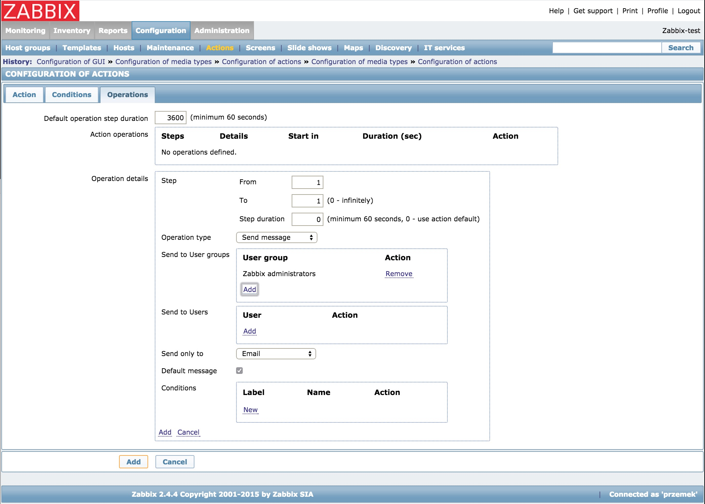
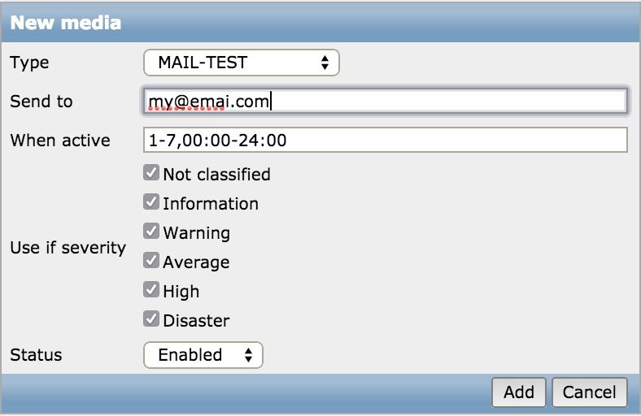

### Zabbix-Server (CentOS-7 + Supervisor)
[Docker Image](https://registry.hub.docker.com/u/million12/zabbix-server/) with Zabbix Server using CentOS-7 and Supervisor.
Image is using external datbase. 

### Database deployment
To be able to connect to database we would need one to be running first. Easiest way to do that is to use another docker image. For this purpose we will use our [million12/mariadb](https://registry.hub.docker.com/u/million12/mariadb/) image as our database.

**For more information about million12/MariaDB see our [documentation.](https://github.com/million12/docker-mariadb) **

Example:  
`docker run \`  
`-d \`  
`--name zabbix-db \`  
`-p 3306:3306 \`  
`--env="MARIADB_USER=username" \`  
`--env="MARIADB_PASS=my_password" \`  
`million12/mariadb`  

***Remember to use the same credentials when deploying zabbix-server image.***

### Environmental Variable
In this Image you can use environmental variables to connect into external MySQL/MariaDB database.

`DB_USER` = database user  
`DB_PASS` = database password  
`DB_ADDRESS` = database address (either ip or domain-name).

### Zabbix-Server  Deployment
Now when we have our database running we can deploy zabbix-server image with appropriate environmental variables set.

Example:  
`docker run \`  
`-d \`  
`--name zabbix \`  
`-p 80:80 \`  
`-p 10051:10051 \`  
`--env="DB_ADDRESS=database_ip" \`  
`--env="DB_USER=username" \`  
`--env="DB_PASS=my_password" \`  
`million12/zabbix-server`

With email settings and Slack integration:
`docker run \`  
`-d \`  
`--name zabbix \`  
`-p 80:80 \`  
`-p 10051:10051 \`  
`--env="DB_ADDRESS=database_ip" \`  
`--env="DB_USER=username" \`  
`--env="DB_PASS=my_password" \`  
`--env="ZABBIX_ADMIN_EMAIL=default@domain.com" \`  
`--env="ZABBIX_SMTP_SERVER=default.smtp.server.com" \`  
`--env="ZABBIX_SMTP_USER=default.smtp.username" \`  
`--env="ZABBIX_SMTP_PASS=default.smtp.password" \`  
`--env="SLACK_WEBHOOK=https://hooks.slack.com/services/QQ3PTH/B67THC0D3/ABCDGabcDEF124" \`  
`million12/zabbix-server`

### Access Zabbix-Server web interface 
To log in into zabbix-server for the first time use credentials `Admin:zabbix`.  

Access web interface under 

> [dockerhost.ip]()  

Follow the on screen instructions.

### Zabbix Push Notifications
Zabbix notification script is located in `/usr/local/share/zabbix/alertscripts`  
Please follow [Zabbkit manual](https://www.zabbix.com/forum/showthread.php?t=41967) to configure notifications. 

### Email Notifications (Server settings)
Using environmental variables on `docker run` you can edit default email server settings. Valuse would be added on into `/usr/local/share/zabbix/alertscripts/zabbix_sendmail.sh`.  
Environmental variables are:  
`ZABBIX_ADMIN_EMAIL=default@domain.com`  
`ZABBIX_SMTP_SERVER=default.smtp.server.com`  
`ZABBIX_SMTP_USER=default.smtp.username`  
`ZABBIX_SMTP_PASS=default.smtp.password`  

Configuration: 
Go into `Administration/Media types` and add new type using `script` as Type. Script name should be `zabbix_sendmail.sh`  
  
Next go to `Configuration/Actions` and create new action. Select recovery message.   
  
Next select tab `Operations` and click New to add new action. In `Send to User groups` add Zabbix Adminstrator or any user group you like.  In `Send only to` select Name of your previously created `Media type` name.  
  
Next go to `Administration/Users` and select your user. Go to Media tab and add new Media. In `Type` select your `Media type` you have created in first step. Add your email addess and enjoy receiving emails.  

 
### Slack Integration
This docker image comes with Slack integrations script. You need to provide your `WebHook` generated in yo your Slack account. it should look like `https://hooks.slack.com/services/QQ3PTH/B67THC0D3/ABCDGabcDEF124`   

Note: this Slack Integration script is based on one originally developed by [ericoc/zabbix-slack-alertscript](https://github.com/ericoc/zabbix-slack-alertscript).
For deatiled installation please see [ericoc instructions](https://github.com/ericoc/zabbix-slack-alertscript). 

## Author
  
Author: Przemyslaw Ozgo (<linux@ozgo.info>)

---

**Sponsored by** [Typostrap.io - the new prototyping tool](http://typostrap.io/) for building highly-interactive prototypes of your website or web app. Built on top of TYPO3 Neos CMS and Zurb Foundation framework.
